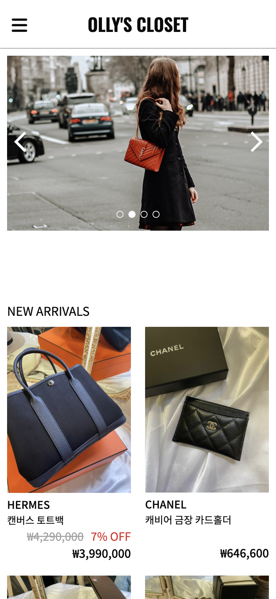
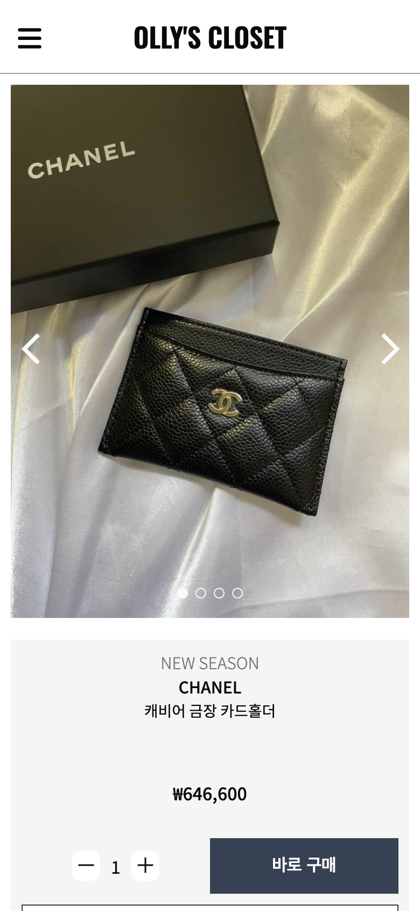
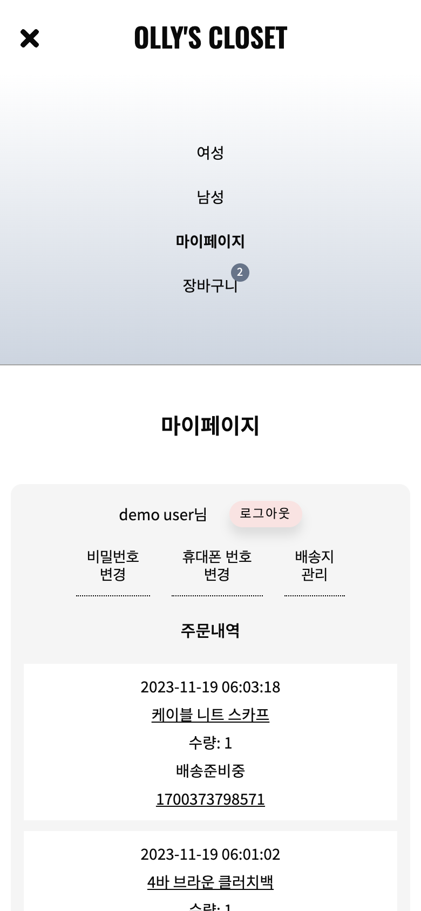

# Welcome to My E-commerce Store Project!

<p align='center'>

</p>

<div align="center">


</div>

## https://ollys-closet.netlify.app

This is an e-commerce store created using Supabase and React. During my time working at a luxury shopping agency, memories from that period came flooding back as I used photos I had taken for this project. Working at that company sparked my interest in coding, and here I am with this project! While the store currently doesn't have a payment feature, I hope to properly operate it someday if I decide to start a business.

## Key Features

- E-commerce store Built with React and Supabase
- Page Navigation and Data Loading with React Router and Loader:
  Seamless navigation between pages and efficient data loading are achieved through the use of React Router and Loader, enhancing the overall user experience.
- User Data Management with Redux:
  The application utilizes Redux for user information. This ensures a centralized and organized approach to state management.
- Styling with Styled-Components and Responsive Design:
  Styled-Components are employed for styling, providing a modular and maintainable structure to the project. The design is responsive, adapting gracefully to various device screen sizes.

<p align='center'>



</p>

Supabase와 React를 활용하여 만든 온라인 쇼핑몰입니다. 명품 구매대행 회사에 근무하던 시절 직접 촬영했던 사진을 사용해서 프로젝트 동안 그때의 추억이 새록새록 떠올랐어요. 실제로 그 회사에 근무하면서 코딩에 관심을 두게 되기도 했고요! 아직 결제 기능이 없는 쇼핑몰이지만 언젠가 사업을 시작하게 된다면 제대로 운영해 보고 싶어요.

## 주요 기능

- React와 Supabase를 활용한 온라인 쇼핑몰 구축
- React Router와 Loader를 사용한 페이지 간의 내비게이션 및 데이터 로딩
- Redux를 활용한 회원 정보 데이터 관리
- Styled-Components를 사용한 스타일링과 디바이스에 따른 반응형 디자인 지원

## How To Use

To clone and run this application, you'll need [Git](https://git-scm.com) and [Node.js](https://nodejs.org/en/download/) (which comes with [npm](http://npmjs.com)) installed on your computer. From your command line:

```bash
# Clone this repository
$ git clone https://github.com/ok-olly/olly-closet.git

# Go into the repository
$ cd olly-closet

# Install dependencies
$ npm install

# Run the app
$ npm run dev
```

> olivia.jeongok.lee@gmail.com &nbsp;&middot;&nbsp;
> GitHub [@ok-olly](https://github.com/ok-olly)
