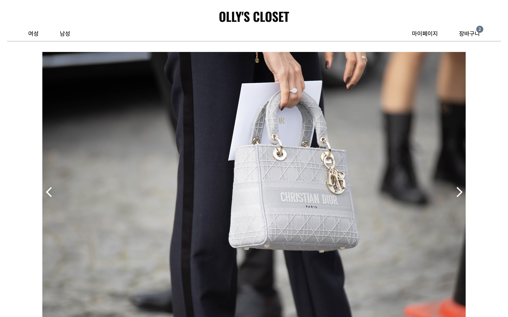

# Welcome to My E-commerce Store Project!

<p align='center'>

</p>


## https://ollys-closet.netlify.app

## Key Features

<!-- react와 supabase로 만든 온라인 쇼핑몰입니다. react-router와 loader를 사용하여 페이지를 이동하고 제품 정보를 supabase에서 받아옵니다. 그리고 redux를 활용하여 supabase와 회원 정보 데이터를 주고받습니다. styled-components로 스타일링 하였으며 디바이스에 따른 반응형 디자인을 지원합니다. -->

- E-commerce Website Built with React and Supabase
- Page Navigation and Data Loading with React Router and Loader:
  Seamless navigation between pages and efficient data loading are achieved through the use of React Router and Loader, enhancing the overall user experience.
- User Data Management with Redux:
  The application utilizes Redux for user information. This ensures a centralized and organized approach to state management.
- Styling with Styled-Components and Responsive Design:
  Styled-Components are employed for styling, providing a modular and maintainable structure to the project. The design is responsive, adapting gracefully to various device screen sizes.

## 주요 기능

- React와 Supabase를 활용한 온라인 쇼핑몰 구축
- React Router와 Loader를 사용한 페이지 간의 내비게이션 및 데이터 로딩
- Redux를 활용한 회원 정보 데이터 관리
- Styled-Components를 사용한 스타일링과 디바이스에 따른 반응형 디자인 지원

## How To Use

To clone and run this application, you'll need [Git](https://git-scm.com) and [Node.js](https://nodejs.org/en/download/) (which comes with [npm](http://npmjs.com)) installed on your computer. From your command line:

```bash
# Clone this repository
$ git clone https://github.com/ok-olly/olly-closet.git

# Go into the repository
$ cd olly-closet

# Install dependencies
$ npm install

# Run the app
$ npm run dev
```

<!-- > [olivia.jeongok.lee@gmail.com](https://olivia-jeongok-lee.netlify.app) &nbsp;&middot;&nbsp; -->

> olivia.jeongok.lee@gmail.com &nbsp;&middot;&nbsp;
> GitHub [@ok-olly](https://github.com/ok-olly)
